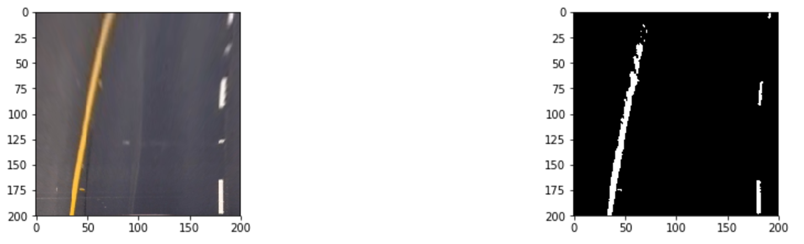

## Advanced Lane Finding Project

The goals / steps of this project are the following:

* Compute the camera calibration matrix and distortion coefficients given a set of chessboard images.
* Apply a distortion correction to raw images.
* Use color transforms, gradients, etc., to create a thresholded binary image.
* Apply a perspective transform to rectify binary image ("birds-eye view").
* Detect lane pixels and fit to find the lane boundary.
* Determine the curvature of the lane and vehicle position with respect to center.
* Warp the detected lane boundaries back onto the original image.
* Output visual display of the lane boundaries and numerical estimation of lane curvature and vehicle position.

The method for this project was experiment driven. I have evaluated number of different approaches including those mentioned in the classes, but also techniques, which seemed to be applicable to the issue of lane lines finding. Although, there is still plenty of places for improvement, the performace of the detection seem to be decent. 

### 1. Camera calibration

The first step of the algorithm is to calculate camera matrix, which is then used to convert from 2d points of the image into real world 3d points (x, y, z). In order to do that, chessboard images are used and I take an assumption, that in the real world, chessboard corners are located on a 2d fixed size grid, where each corner has coordinates in form of (x, y, 0). The camera matrix is calculated by finding the corners on the actual images and mapping them into mentioned coordinates. 

To accomplish steps mentioned in the previous paragraph, I used cv2.calibrateCamera(). The calculated matrix is then used to get rid of any distortions, which could be introduced by the camera. Please see the examples below:

### 2. Pipeline

The basic pipeline might be splited into following steps:
1. Image undistortion
2. Image warping
3. Converting into gray
4. Image smoothing
5. Gradient calculation
6. Color segmentation
7. Combine steps 5 and 6
8. Find lanes
9. Calculate curvature and position

Each of the steps is described below

#### 2.1 Image undistortion

This step involves undistoring raw images using the camera matrix calculatd as described above. Here is an example of such undistortion:

#### 2.2 Image warping

The next step of the pipeline is to convert the original image into bird-eye perspective. It makes the lane lines nearly parallel and makes the problem a bit easier. There is a class called PerspectiveWarping, which contains the code responsible for this transformation.

However, before applying such transformation, I firstly had to define an area of the image (region of interest) to be warped. Please find the ROI and the actual warping below:

#### 2.3 Converting into gray

Now, the pipeline is splited into two branches. The first of them, is aimed to extract gradients information, the second, to perform color based segmentation. For the first one, we need to convert the image into gray, smooth it and then calculate gradients.

In order to conver the image to gray I simply <b>extract R channel from RGB image</b>.

#### 2.4 Image smoothing

At this step, the <b>lane lines are nearly vertical and parallel</b>, therefore we may take benefit of such information. I defined a <b>Difference of Gaussian (DoG)</b> kernel, which one is applied to vertical axis of the image. The kernel <b>promotes bright lines of given height on dark background</b>.

Below you may find an example of the DoG, original image and image after smoothing. The code is located in the class ImageFilter.

#### 2.5 Gradient calculation

I calculated the <b>second derivate of a Guassian and applied it among horizontal axis</b> to get vertical lines. <b>Sigma parameter of the gaussian was chosen according to the desired lane width</b>. Finally <b>I calculated 97.5 percentile and filter all the pixels below its value</b>. The code might be found as well in ImageFilter class. Please see the result below:

#### 2.6 Color segmentation

At this moment I have the vertical lines extracted. However there might be road artifacts, which have similar properties to lane lines. Therefore color segmentation is a step, that makes the algorithm more robust.

I have used HSV color space and opencv inRange() function to get only parts of the image, which are interesting for the algorithm.

#### 2.7 Combine color information with gradients

Now, I can use both features (color, gradients) to create a robust algorithm - I can <b>combine gradient information with color segmentation</b>. It's done by simply using bitwise_and operation. One more thing to mention is <b>gradient image is dilated</b> before combining it with color segmentation.

Left image - dilated gradient, center - color segmentation, right - combined images.

#### 2.8 Line finding

Now, when I have a binary image of the lines, I can start the actual procedure of line finding. It starts by taking a histogram along all the columns in the lower half of the binary image.

Now, I can define a sliding window centered at the bottom of the image, at the x coordinate (where x corresponds to histogram peaks) and move it up, step by step, and recenter at each of the step, depending on the amount of white pixels.

 
 
Finally, the center of each window is used in <b>numpy polyfit</b> algorithm, which finds coefficients of the polynomians describing lines. The last step of line finding is to map them into original image. It should look something like this:

#### 2.9 Measuring curvature and car position

Finally, knowing the parameters of the polynomians and pixels to meters conversion, I am able to calculate the radius of the curve. It's been implemented in the class CurvatureEstimator. 

One more thing, that is worth adding at this point is the case of straight road. This situation might be considered as a curvature of a circle with infinit large radius. Therefore all curvatures greater than 1.5km are considered as straight line and the value of 0 is presented as a curvature.

In order to determine car position within the lanes, I assume the camera is located in the center of the image. I also calculate where the fitted lanes should be located at the very bottom of the image. The next step is to calculate the road center and compare it to the car position, so that I can determine how far from the road center, the car is.

#### 2.10 Pipeline improvements

In order to make the algorithm more stable, I provide to the algorithm an input, which is a concatenation of several video frames. Thanks to that, the images were no lines appear, are combined with such images where lines are present. 

Moreover, I assume the lines should be located in the edges of region of interest, therefore I can safely remove the content of the image located in the center. Thanks to that, I can skip road artifacts, which may affect lines finding.

I also skip recalculating the histograms, when one was already found, as at this moment the algorithm already knows, where to look for the lines. However, when the lines are not found, I fallback to the procedure of histogram lines finding.

## 3. Results

Please find the result of the above algorithm on the video below. Clicking on it will move you to youtube to the full version of the video.

After simple modifications (Region of interest), the algorithm works well for the challenge video as well:

## 4. Discussion and possible improvements

Color based segmentation requires lot's of tuning and considering number of ligthning conditions, where the model needs to perform well. Gradients are not color related, but they may find also road artifacts, which are far from being actual lines. However combining both approaches seem to give pretty good results.

The histogram based approach might be very weak, when considering sharp curves, as they may become almost horizontal in bird eye view images. In this case there might be number of peaks on the histogram, or the peaks may not really coresspond to the initial position of sliding windows. Therefore a different method should be considered. Also the smoothing method provided in this writeup, might be not sufficient for such cases.

Kalman-filter could be used, when line coordinates can't be found, as it may 'predict' new coordinates on the base of the previous observations. 
